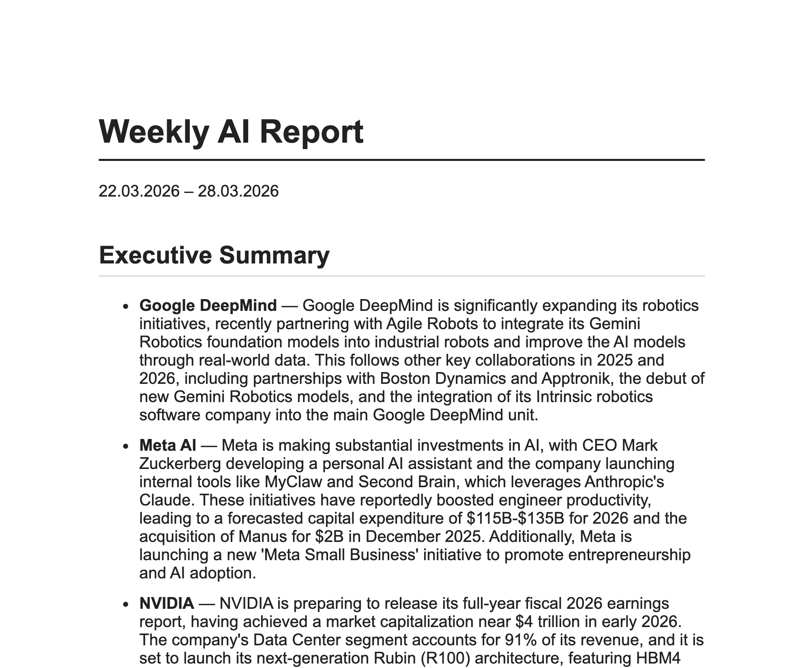
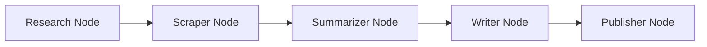

<h1 align="center">AI Newsletter Agent</h1>

<p align="center">
  
  
  
  
  
</p>

**An autonomous market intelligence agent that researches, scores, and summarises the week's most relevant AI industry news and delivers a structured report straight to your inbox.**

This project demonstrates a production-grade agentic workflow using **LangGraph**, **Python**, and **Google Gemini 2.5 Flash**. It automates the full lifecycle of a newsletter: from monitoring targeted companies and scraping complex webpages to synthesizing technical developments and delivering a structured HTML email with a PDF attachment.

---

## Preview



[View example newsletter (PDF)](output/newsletter_2026-03-28-1.pdf)

---

## System Architecture

The system is architected as a stateful graph using **LangGraph**, where a typed `NewsletterState` dictionary is passed between specialized nodes. An **AsyncIO** event loop handles concurrent scraping and API calls efficiently throughout the pipeline.



### Workflow Pipeline

1. **Research Node**

   - Queries the **Tavily API** for news from the last 7 days for each target company.
   - Filters results by relevance score, keyword matching, and URL deduplication across companies.
   - Excludes listing pages, tag pages, and blacklisted domains. Keeps at most 2 articles per company.

2. **Scraper Node**

   - **Hybrid Strategy**: Attempts lightweight static extraction using `trafilatura` first. If the result is empty, too short, or blocked, it escalates to a full browser.
   - **Stealth Browsing**: Uses **Playwright (Async)** with `playwright-stealth` to bypass anti-bot protections and render JavaScript-heavy pages.
   - **Concurrency**: Manages up to 3 parallel browser instances via `asyncio.Semaphore`. Detects soft blocks such as paywall prompts and bot challenges.

3. **Summarizer Node**

   - **Two-step pipeline**: First scores each article 1–10 for newsworthiness, dropping anything below 5 including stale breaking news older than 14 days.
   - Groups passing articles by company and generates a structured summary with extracted key facts using **Gemini 2.5 Flash**.
   - Handles API rate limits (429) and overload responses (503) with automatic retry and exponential backoff.

4. **Writer Node**

   - Generates a cohesive prose paragraph per company from the extracted key facts via **Gemini 2.5 Flash**.
   - Assembles the final HTML newsletter with an executive summary section and detailed per-company reports.
   - Enforces source-only citations: the model is strictly instructed to use only URLs from the provided source articles, preventing hallucinated links.

5. **Publisher Node**

   - Renders the HTML newsletter to PDF in memory via headless **Chromium**.
   - Sends an HTML email with the PDF attached via **Gmail SMTP** using STARTTLS encryption.
   - Retries up to 3 times on send failure with exponential backoff.

---

## Technical Highlights

- **Hybrid Scraping Strategy**: Trafilatura handles the majority of pages quickly without a browser. Playwright with stealth injections serves as a resilient fallback for JavaScript-heavy or bot-protected pages.
- **Two-step Scoring Pipeline**: Articles are scored for relevance before any summarization call, keeping LLM token usage low and output quality high.
- **Hallucination Guardrails**: The writer prompt strictly enforces reliance on provided source URLs, preventing the model from inventing citations or importing stale knowledge from training data.
- **Typed State Management**: A `NewsletterState` TypedDict flows through every node, making data contracts explicit and the pipeline easy to extend.
- **Async Concurrency**: `asyncio.Semaphore` controls parallelism across both scraping and summarization to stay within resource and rate-limit boundaries.

---

## Tech Stack

| Layer | Technology |
|---|---|
| Orchestration | LangGraph |
| LLM | Google Gemini 2.5 Flash |
| Web Search | Tavily API |
| Web Scraping | Playwright + Trafilatura |
| PDF Generation | Playwright (headless Chromium) |
| Email Delivery | Python smtplib (Gmail SMTP) |
| Frontend | Streamlit |
| Data Models | Pydantic |

---

## Project Structure

```
ai-newsletter-agent/
├── .env.example            # Template for required environment variables
├── requirements.txt
├── main.py                 # Headless entry point
├── app.py                  # Streamlit UI entry point
├── config/
│   ├── companies.py        # Target companies and search keywords
│   ├── schemas.py          # Pydantic models: Article, Summary, Newsletter
│   └── settings.py         # Loads environment variables
├── graph/
│   ├── graph.py            # LangGraph pipeline definition
│   └── state.py            # NewsletterState TypedDict
├── nodes/
│   ├── research.py         # Tavily search node
│   ├── scraper.py          # Playwright scraping node
│   ├── summarizer.py       # Gemini scoring and summarisation node
│   ├── writer.py           # Gemini newsletter writing node
│   └── publisher.py        # SMTP email delivery node
└── output/                 # Example output (screenshot + PDF)
```

---

## Installation & Setup

### Prerequisites

- Python 3.11+
- A Google Gemini API key (free tier available at [aistudio.google.com](https://aistudio.google.com))
- A Tavily API key (free tier available at [app.tavily.com](https://app.tavily.com))
- A Gmail account with an App Password

### Steps

```bash
# 1. Clone the repository
git clone https://github.com/yourusername/ai-newsletter-agent.git
cd ai-newsletter-agent

# 2. Create and activate a virtual environment
python -m venv .venv
source .venv/bin/activate        # macOS/Linux
.venv\Scripts\activate           # Windows

# 3. Install dependencies
pip install -r requirements.txt

# 4. Install Playwright browsers
playwright install chromium

# 5. Set up environment variables
cp .env.example .env
# Open .env and fill in your API keys and email config

# 6. Run the Streamlit UI
streamlit run app.py

# or run headless
python main.py
```

---

## Environment Variables

Create a `.env` file based on `.env.example`:

```env
# Google Gemini API — for scoring, summarization, and newsletter writing (free)
GEMINI_API_KEY=your_gemini_api_key_here

# Tavily API — for web search (free tier)
TAVILY_API_KEY=your_tavily_api_key_here

# Email config — sender address
EMAIL_FROM=your_email@gmail.com

# Email config — recipient address
EMAIL_TO=recipient@example.com

# Gmail app password or SMTP password
SMTP_PASSWORD=your_app_password_here
```


---

## License

This project is licensed under the MIT License.
